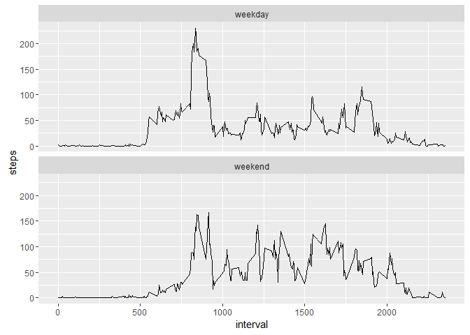

# Reproducible Research: Peer Assessment 1

This is the first peer assessed assignment for the Reproducible Research course. The `data.table` package will be used for manipulating the data and `ggplot2` for drawing figures. The `fasttime` package will be used to convert the `character` date variable to `POSIXct`. Before beginning, here is some information about the machine which was used to run the analysis:


```r
R.version
```

```
##                _                           
## platform       x86_64-w64-mingw32          
## arch           x86_64                      
## os             mingw32                     
## system         x86_64, mingw32             
## status                                     
## major          3                           
## minor          3.1                         
## year           2016                        
## month          06                          
## day            21                          
## svn rev        70800                       
## language       R                           
## version.string R version 3.3.1 (2016-06-21)
## nickname       Bug in Your Hair
```

```r
Sys.info()[c(1:3, 5)]
```

```
##       sysname       release       version       machine 
##     "Windows"      "10 x64" "build 10586"      "x86-64"
```

Let's load up the packages we depend on and check which versions we are using.


```r
library(data.table)
library(ggplot2)
library(fasttime)
packageVersion("data.table")
```

```
## [1] '1.9.6'
```

```r
packageVersion("ggplot2")
```

```
## [1] '2.1.0'
```

```r
packageVersion("fasttime")
```

```
## [1] '1.0.1'
```

## Loading and preprocessing the data

We will use `fread` from the `data.table` package to read in the data.


```r
uncompressed_csv <- unzip("activity.zip", exdir = tempdir())
raw_data <- fread(uncompressed_csv)
unlink(uncompressed_csv)
```

For some reason `fread` was not able to read the zip archive directly, even though I believe it's supposed to.

## What is mean total number of steps taken per day?

Here is a histogram of the number of steps taken each day.


```r
total_per_day <- raw_data[, .(steps = sum(steps, na.rm = TRUE)), by = date]
gg <- ggplot(total_per_day, aes(steps))
gg + geom_histogram(bins = 15, color = "orange", fill = "blue")
```

<!-- -->

As we can see, on most days the subject has taken very few steps or around 9,000 to 15,000 steps. There s a clear spike right above 10,000 steps.

Here are the mean and median number of steps taken per day:


```r
total_per_day[, mean(steps)]
```

```
## [1] 9354.23
```

```r
total_per_day[, median(steps)]
```

```
## [1] 10395
```

## What is the average daily activity pattern?

The number of steps is measured every 5 minutes. Next we'll plot the average day by averaging each 5 minute interval across all days.


```r
mean_steps_by_interval <- raw_data[, .(steps = mean(steps, na.rm = TRUE)), by = interval]
gg <- ggplot(mean_steps_by_interval, aes(interval, steps))
gg + geom_line()
```

<!-- -->

It's a bit difficult to see exactly which interval contains the maximum number of steps on average.


```r
mean_steps_by_interval[which.max(steps), interval]
```

```
## [1] 835
```

There it is!

## Imputing missing values

There are some missing values in our data set. They can skew the mean and median number of steps we computed earlier. We will attempt to mitigate the effect of missing values by replacing them with the mean of the respective interval across all days.


```r
filled_data <- copy(raw_data)
filled_data[, interval_mean := mean(steps, na.rm = TRUE), by = interval]
filled_data[, steps := as.numeric(steps)]
filled_data[is.na(steps), steps := interval_mean]
filled_data[, interval_mean := NULL]
```

Let's redraw that histogram of the total steps taken each day and see if it looks different from the first one.


```r
filled_total_per_day <- filled_data[, .(steps = sum(steps)), by = date]
gg <- ggplot(filled_total_per_day, aes(steps))
gg + geom_histogram(bins = 15, color = "blue", fill = "orange")
```

<!-- -->

It's quite different! There are definitely fewer days in the 0 bin. This makes sense because the sum for each day is higher now that we replaced all `NA` intervals with values greater than zero.

## Are there differences in activity patterns between weekdays and weekends?

Using the data set where we imputed missing values, we want to know if the daily activity pattern looks different between weekdays and weekends.


```r
filled_data[, weekday_or_weekend := factor(ifelse(weekdays(fastPOSIXct(date), TRUE) %in% c("Sat", "Sun"), 'weekend', 'weekday'))]
mean_steps_by_interval_weekdays <- filled_data[, .(steps = mean(steps)), by = "interval,weekday_or_weekend"]
gg <- ggplot(mean_steps_by_interval_weekdays, aes(interval, steps))
gg + geom_line() + facet_wrap(~ weekday_or_weekend, 2, 1)
```

<!-- -->

It appears that during the weekend the subject walks more throughout the whole day while on weekdays most of the steps are taken in the morning.
